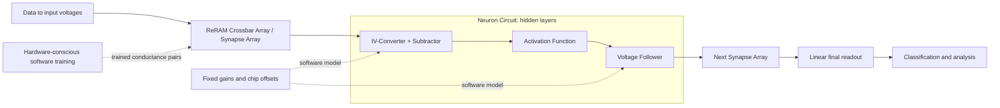

# HCST: teaching software about a real analog circuit

[](https://github.com/Scophield/HCST/actions/workflows/ci.yml)

**Hardware-conscious software training for a Fully Analog ReRAM Inference Accelerator.** This repository connects a voltage-domain neural network to the circuit that would execute it: a differential ReRAM Synapse Array followed by a Neuron Circuit.

The reference method is the **JJAP MNIST HCST** work by Shuchao Gao and Takashi Ohsawa, DOI [10.35848/1347-4065/ad1895](https://doi.org/10.35848/1347-4065/ad1895). This first public version is a newly written, source-informed **reference framework**, not the complete original experiment scripts and not a claim to have reproduced the paper's reported accuracy. It contains an independently runnable numerical chain, mathematical model, circuit interfaces and verification evidence. Original training scripts must be supplied separately for the optional source adapter.

## Why the circuit belongs inside the training loop

An ideal neural network sees weighted sums and activations. A real analog network sees conductances, reference voltages, finite amplifier gains and device-to-device offsets. Weights learned for the ideal network can produce different voltages when deployed to the actual circuit.

HCST makes those circuit characteristics part of the software training model. A fixed set of circuit parameters describes a particular chip. Software trains for that model before the final conductances are deployed, rather than asking the memory devices to perform the full sequence of training updates.



**ReRAM Crossbar Array** and **Synapse Array** name the same block. **IV-Converter + Subtractor, Activation Function, and Voltage Follower** together form the **Neuron Circuit**. **ReLU** is the implemented JJAP baseline instance of Activation Function. The final layer uses linear readout and bypasses activation/follower, matching the inspected source model.

## One command chain that runs without private files

Python 3.9+ and NumPy are enough. No Torch, HSPICE, dataset, pretrained weights, PDK or server connection is required for the CPU demo.

```sh
git clone https://github.com/Scophield/HCST.git
cd HCST
python -m venv .venv
# Activate .venv using your operating system's command.
python -m pip install '.[test]'
reram run --config configs/smoke.json --out runs/smoke-001
python -m pytest -q
```

The demo uses synthetic data and a small network to exercise the **same finite-gain equations and conductance mapping** as the MNIST-shaped model. It is a pipeline check, not an IRIS/MNIST accuracy result. Every run requires a new output directory and records configuration, seed, environment/code hashes, progress, trained pairs, results, behavioral netlist and expected circuit measurements. `COMPLETE.json` appears only after final evaluation and artifact writing.

## The executable circuit model

The core code is readable independently of any historical script:

| Layer | Public implementation | Role |
|---|---|---|
| Synapse Array | [architecture.py](src/reram/architecture.py), [mapping.py](src/reram/mapping.py) | Differential conductances, column sums and physical resistance mapping |
| Neuron Circuit | [architecture.py](src/reram/architecture.py) | Finite-gain IVC, subtraction, Activation Function and follower |
| Network and gradients | [model.py](src/reram/model.py) | Full voltage forward chain and verified smooth-region derivatives |
| Reproducible experiments | [experiment.py](src/reram/experiment.py), [configs](configs/) | Fixed chip offsets, separate train/test splits, logs and controlled comparisons |
| Circuit interface | [netlist.py](src/reram/netlist.py), [hspice.py](src/reram/hspice.py) | Resistor/dependent-source deck, optional external transistor definitions, measurement comparison |
| Original-source reference | [training.py](src/reram/training.py), [legacy.py](src/reram/legacy.py) | Optional adapter to an authorized historical source/checkpoint copy |

For a branch with `s=sum(g)`, `q=sum(Vin*g)` and `d=gL*(GI+1)+s`, the IVC output is:

```text
Braw = [(VrefI + GI*(V0 + VosI))*(gL+s) - GI*q] / d
B = max(Braw, IVC_floor)
U = (Bn - Bp + V0 + 2*VosS + 2*VrefS/GS) * GS/(GS+2)
A = V0 if U <= V0 - VosA else U               # baseline ReLU
Yhidden = (A + VosF + VrefF/GF) * GF/(GF+1)
Yfinal = U
```

The source-derived hidden IVC floor is .05 V; the final-layer source overrides it to 1e-9 V. With the baseline generator's scale, `Gphysical=g*1e-5 S`, `R=100000/g` ohm. Zero conductance emits no resistor. These details matter: substituting gains, loads, offsets or readout limits can invalidate a comparison even when filenames match. See [architecture and equations](docs/ARCHITECTURE.md).

## Training backends: keep the claims separate

| Backend | What it means |
|---|---|
| `experimental-analytic` (default) | Standalone experimental optimizer using exact derivatives of this numerical forward model, mean batch loss and signed conductance projection. **Not equivalent to original HCST optimization.** |
| `legacy-source` | Optional execution of the inspected original classes' forward/backward/update on CPU, using an authorized source directory supplied by the caller. Preserves original hand gradients and update ordering. **Not a reconstructed paper training schedule.** |
| Historical checkpoint evaluation | Evaluate specifically identified weights, offsets and a matched parameter profile. **Not new training or proof of publication-era identity.** No historical weights are distributed here. |

`analytic` and `legacy` are compatibility aliases; new result files report the explicit names and support levels. The original hand gradients differ from the exact derivatives by more than mean/sum normalization, so the backends must not be mixed or advertised as equivalent.

For a small independent MNIST computation:

```sh
python tools/download_mnist.py --out data/mnist-raw
reram run --config configs/mnist_small.json --data data/mnist-raw --out runs/mnist-001
```

The download is explicit and checks archive hashes. Data is not bundled. The config keeps the JJAP-shaped **784x256x128x10** topology, but uses a limited subset/schedule and the inspected current-source parameter profile, not an established publication-era profile.

For source-compatible optimization, obtain an authorized original copy separately:

```sh
python -m pip install '.[legacy]'
reram run --config configs/mnist_small.json --data /authorized/mnist-raw --training-backend legacy-source --source /authorized/training_tensor --out runs/source-001
python tools/audit_training.py --source /authorized/training_tensor --out runs/source-update-audit.json
```

No original source main program is executed. The adapter extracts selected classes; the independent audit invokes the original orchestration functions. Private-source tests are skipped when that source is absent. This repository does not grant redistribution rights for the external scripts.

## Evidence, including the inconvenient results

The computational model is checked against independent nodal KCL, finite differences, clipping/readout boundaries, deterministic runs and netlist structure. A fixed smooth-region three-layer test checks 30 signed weights with maximum central-difference gradient error about **2.11e-11**. A separate local audit compared the source adapter against the actual original orchestration functions for ten identical batch updates: conductance and loss differences were **zero**. See [training semantics](evidence/training_semantics_audit.json).

New bounded 2026 computations used 2,048 training / 1,024 test MNIST samples, 40 epochs, batch 32, a fixed seed and chip offsets, and unchanged preprocessing and learning rate:

| Backend | Offline, zero offsets | Offline weights deployed to fixed nonideal model | Trained for the same nonideal model |
|---|---:|---:|---:|
| Original-source adapter | 64.26% | 11.43% | 44.73% |
| Experimental analytic | 9.57% | 12.89% | 9.57% |

These are **new resource-limited computational experiments**, not paper metrics or transistor results. The original-source example shows recovery under its recorded setup; the experimental optimizer does not. No hyperparameter search or accuracy-definition change was used. Neither result proves general effectiveness/ineffectiveness of HCST. [Evidence and limits](docs/EVIDENCE.md) explains the configurations and their provenance. Full trained models and image samples are excluded.

## Optional circuit validation and extension

Each CPU run produces `sample_behavioral.sp` and `expected_measures.json`. An existing licensed HSPICE installation can run it and compare all expected measurements:

```sh
# Set HSPICE_EXE locally to an already authorized executable or wrapper.
reram hspice --deck runs/smoke-001/sample_behavioral.sp --out runs/spice-001
reram compare --listing runs/spice-001/simulation.lis --expected runs/smoke-001/expected_measures.json --out runs/comparison-001.json
```

The transistor generator additionally requires external authorized subcircuit/model files. **No HSPICE simulation has been verified for this public version.** Exit status alone is insufficient: expected measurements must exist and be compared. There are no credentials or remote-account setup steps in this project.

New numerical Activation Function implementations can register an explicit voltage transfer and derivative via [activation.py](src/reram/activation.py). Only ReLU has an implemented SPICE generation path; a custom numerical activation is rejected by the generator until a circuit backend exists. Numerical support does not imply transistor validation.

The present ReRAM representation is static conductance. It does not model switching/programming, retention, nonlinear device I-V, 1T1R access devices, interconnect RC, upper supply clipping, switched-capacitor compensation, pipeline timing, power or area. Outputs outside physical rails can occur. New compensation/pipeline research is not folded into this baseline.

## Research provenance and license

JJAP MNIST is the main reference; [SSDM 2023](https://arxiv.org/abs/2609.04259) provides architectural context. The arXiv upload is dated 2026, while the conference work is from 2023. The original parameter/checkpoint/chip/schedule identity still needs to be established before claiming paper reproduction. See [provenance](docs/PROVENANCE.md), [reproduction gaps](docs/REPRODUCTION_GAPS.md) and [中文快速上手](QUICKSTART.zh-CN.md).

The newly authored software is released under [MIT](LICENSE), selected under the repository owner's delegated release decision. The license does not cover external research scripts, models, checkpoints, datasets or papers; see [NOTICE](NOTICE.md). Cite the method's authors and papers via [CITATION.cff](CITATION.cff).
