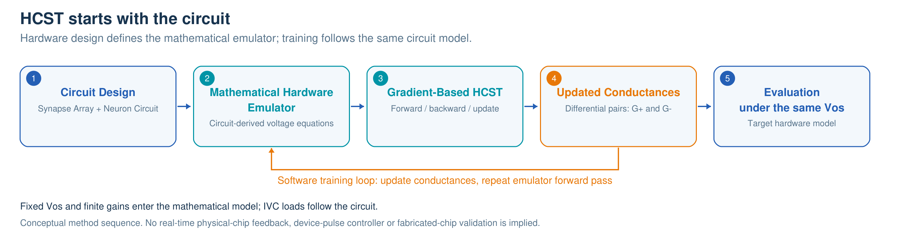
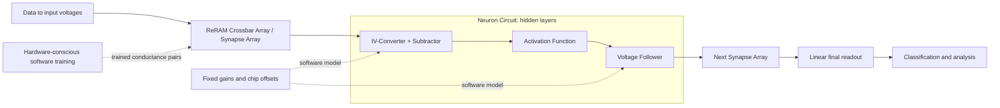
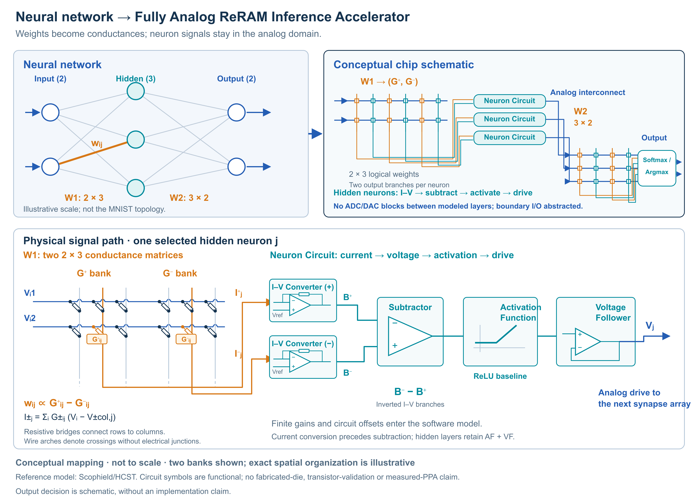
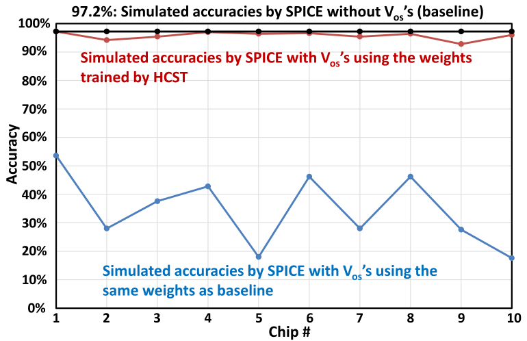
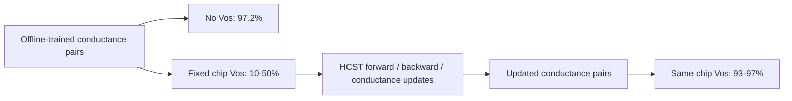

# HCST: teaching software about a real analog circuit

[](https://github.com/Scophield/HCST/actions/workflows/ci.yml)

**Hardware-Conscious Software Training (HCST) for a Fully Analog ReRAM Inference Accelerator.** This repository connects a voltage-domain neural network to the circuit that would execute it: a differential ReRAM Synapse Array followed by a Neuron Circuit.

The reference method is **Hardware-Conscious Software Training (HCST)**, proposed by Shuchao Gao and Takashi Ohsawa. See the [JJAP paper](https://doi.org/10.35848/1347-4065/ad1895), [SSDM paper](https://doi.org/10.7567/SSDM.2023.J-5-03), and its [arXiv version](https://doi.org/10.48550/arXiv.2609.04259). This repository provides a source-informed computational implementation, circuit interfaces and independently runnable examples. It does not distribute the complete original experiment scripts or claim a new reproduction of the paper's accuracy.

## Why the circuit belongs inside the training loop

An ideal neural network sees weighted sums and activations. A real analog network sees conductances, reference voltages, finite amplifier gains and device-to-device offsets. Weights learned for the ideal network can produce different voltages when deployed to the actual circuit.

HCST makes those circuit characteristics part of the software training model. A fixed set of circuit parameters describes a particular chip. Software trains for that model before the final conductances are deployed, rather than asking the memory devices to perform the full sequence of training updates.

The development starts with **the hardware circuit design**, not an ideal neural network trained independently of its implementation. From the Synapse Array and Neuron Circuit, we derive a **hardware-derived mathematical emulator** (a mathematical digital twin): voltage/conductance equations that reflect the circuit topology, finite amplifier gains, fixed Vos, and IVC load conductances. These are the forward relations in JJAP Section 4.2, Eqs. (1)-(5).

Training then follows this emulator: its circuit-aware forward and backward formulations define gradient-based descent and updates of the differential conductances (Section 4.3, Eqs. (6)-(14)). The updated conductances are mapped back to the target hardware model and evaluated under the **same fixed Vos**. This hardware-to-model-to-training order keeps optimization tied to the circuit that will perform inference, whereas conventional ideal-network offline training omits those circuit characteristics. Mathematical digital twin here means a circuit-derived software model, not a real-time synchronized physical chip; the paper's evaluation used SPICE without fabricated chips. The original-source update path and the public experimental analytic optimizer remain distinct, as described below.



**Method development and training sequence.** Hardware design comes first; its mathematical emulator then guides gradient-based HCST and conductance updates. The feedback arrow represents repeated forward/backward/update steps inside software training, not a real-time physical-chip loop. Evaluation uses the same fixed Vos. [Editable SVG](docs/figures/hcst-circuit-emulator-training.svg). Original project artwork, covered by MIT.



**ReRAM Crossbar Array** and **Synapse Array** name the same block. **IV-Converter + Subtractor, Activation Function, and Voltage Follower** together form the **Neuron Circuit**. **ReLU** is the implemented JJAP baseline instance of Activation Function. The final layer uses linear readout and bypasses activation/follower, matching the inspected source model.



**Schematic neural-network-to-circuit mapping.** This original illustration maps logical weights to differential conductance pairs, then expands the hidden Neuron Circuit into IV-Converter + Subtractor, Activation Function and Voltage Follower. The 2x3x2 network is illustrative, not the MNIST topology. Softmax / Argmax denotes a conceptual output decision: the implemented model retains linear voltage readout and classification by argmax; no analog Softmax implementation or circuit validation is claimed. [Editable SVG](docs/figures/fully-analog-reram-network-to-chip.svg). This original figure is covered by the project MIT license; the separate original-paper Fig. 13 retains its own rights statement.

## One command chain that runs without private files

Python 3.9+ and NumPy are enough. No Torch, HSPICE, dataset, pretrained weights, PDK or server connection is required for the CPU demo.

```sh
git clone https://github.com/Scophield/HCST.git
cd HCST
python -m venv .venv
# Activate .venv using your operating system's command.
python -m pip install '.[test]'
reram run --config configs/smoke.json --out runs/smoke-001
python -m pytest -q
```

The demo uses synthetic data and a small network to exercise the **same finite-gain equations and conductance mapping** as the MNIST-shaped model. It is a pipeline check, not an IRIS/MNIST accuracy result. Every run requires a new output directory and records configuration, seed, environment/code hashes, progress, trained pairs, results, behavioral netlist and expected circuit measurements. `COMPLETE.json` appears only after final evaluation and artifact writing.

## The executable circuit model

The core code is readable independently of any historical script:

| Layer | Public implementation | Role |
|---|---|---|
| Synapse Array | [architecture.py](src/reram/architecture.py), [mapping.py](src/reram/mapping.py) | Differential conductances, column sums and physical resistance mapping |
| Neuron Circuit | [architecture.py](src/reram/architecture.py) | Finite-gain IVC, subtraction, Activation Function and follower |
| Network and gradients | [model.py](src/reram/model.py) | Full voltage forward chain and verified smooth-region derivatives |
| Reproducible experiments | [experiment.py](src/reram/experiment.py), [configs](configs/) | Fixed chip offsets, separate train/test splits, logs and controlled comparisons |
| Circuit interface | [netlist.py](src/reram/netlist.py), [hspice.py](src/reram/hspice.py) | Resistor/dependent-source deck, optional external transistor definitions, measurement comparison |
| Original-source reference | [training.py](src/reram/training.py), [legacy.py](src/reram/legacy.py) | Optional adapter to an authorized historical source/checkpoint copy |

For a branch with `s=sum(g)`, `q=sum(Vin*g)` and `d=gL*(GI+1)+s`, the IVC output is:

```text
Braw = [(VrefI + GI*(V0 + VosI))*(gL+s) - GI*q] / d
B = max(Braw, IVC_floor)
U = (Bn - Bp + V0 + 2*VosS + 2*VrefS/GS) * GS/(GS+2)
A = V0 if U <= V0 - VosA else U               # baseline ReLU
Yhidden = (A + VosF + VrefF/GF) * GF/(GF+1)
Yfinal = U
```

The source-derived hidden IVC floor is .05 V; the final-layer source overrides it to 1e-9 V. With the baseline generator's scale, `Gphysical=g*1e-5 S`, `R=100000/g` ohm. Zero conductance emits no resistor. These details matter: substituting gains, loads, offsets or readout limits can invalidate a comparison even when filenames match. See [architecture and equations](docs/ARCHITECTURE.md).

## Training backends: keep the claims separate

| Backend | What it means |
|---|---|
| `experimental-analytic` (default) | Standalone experimental optimizer using exact derivatives of this numerical forward model, mean batch loss and signed conductance projection. **Not equivalent to original HCST optimization.** |
| `legacy-source` | Optional execution of the inspected original classes' forward/backward/update on CPU, using an authorized source directory supplied by the caller. Preserves original hand gradients and update ordering. **Not a reconstructed paper training schedule.** |
| Historical checkpoint evaluation | Evaluate specifically identified weights, offsets and a matched parameter profile. **Not new training or proof of publication-era identity.** No historical weights are distributed here. |

`analytic` and `legacy` are compatibility aliases; new result files report the explicit names and support levels. The original hand gradients differ from the exact derivatives by more than mean/sum normalization, so the backends must not be mixed or advertised as equivalent.

For a small independent MNIST computation:

```sh
python tools/download_mnist.py --out data/mnist-raw
reram run --config configs/mnist_small.json --data data/mnist-raw --out runs/mnist-001
```

The download is explicit and checks archive hashes. Data is not bundled. The config keeps the JJAP-shaped **784x256x128x10** topology, but uses a limited subset/schedule and the inspected current-source parameter profile, not an established publication-era profile.

For source-compatible optimization, obtain an authorized original copy separately:

```sh
python -m pip install '.[legacy]'
reram run --config configs/mnist_small.json --data /authorized/mnist-raw --training-backend legacy-source --source /authorized/training_tensor --out runs/source-001
python tools/audit_training.py --source /authorized/training_tensor --out runs/source-update-audit.json
```

No original source main program is executed. The adapter extracts selected classes; the independent audit invokes the original orchestration functions. Private-source tests are skipped when that source is absent. This repository does not grant redistribution rights for the external scripts.

## Paper evidence: recover accuracy under fixed Vos

The JJAP experiment considers **fixed op-amp input offsets, Vos**, assigned per simulated chip, together with finite open-loop gains. Offline training omits those offsets. Deploying its weights to the model with Vos lowers accuracy. HCST incorporates the same circuit parameters into forward propagation, backpropagation and conductance updates; deploying the updated weights to that same offset-bearing circuit restores accuracy.

| JJAP-reported condition | Accuracy | Source |
|---|---:|---|
| Offline weights, no Vos | 97.2% | Section 6, Fig. 13 |
| Same offline weights, with each simulated chip's Vos | 10-50% | Section 6, Fig. 13 |
| HCST-updated weights, evaluated with the same chip's Vos | 93-97% | Fig. 13; Section 8 summary |

These are **paper-reported SPICE results across ten simulated chips**, not values generated by this repository. The paper uses MNIST, a **784x256x128x10** network, **32 nm**, **VDD=1.0 V**, **V0=0.5 V**, **gmin=0.01 mS**, **gmax=1 mS**, and **gL=1 mS**. Its illustration waveform uses 1 us per input (600 ns active, 400 ns precharge); this is not a demonstrated minimum latency. The current source-derived code profile and resistance scale differ from those paper parameters: see [paper parameter correspondence](docs/PAPER_EVIDENCE.md).



**Fig. 13 (original paper figure).** Offline-trained conductances give 97.2% without offsets (black); deploying them to ten simulated chips with Vos degrades accuracy (blue); HCST-updated conductances recover accuracy under the same chip offsets (red). From Gao and Ohsawa, *Jpn. J. Appl. Phys.* **63**, 02SP63 (2024), [doi:10.35848/1347-4065/ad1895](https://doi.org/10.35848/1347-4065/ad1895). Copyright 2024 The Japan Society of Applied Physics. Reused by the original author under author-retained figure rights; **excluded from MIT**. See [figure provenance](docs/FIGURE_RIGHTS.md).



*New explanatory schematic adapted from the experimental sequence in JJAP Figs. 2, 10 and 13. Ranges summarize the paper text; no per-chip data points are invented. This is not a reproduction of the original artwork.*

The case demonstrates recovery under the recorded fixed-offset model. It does not establish compensation for arbitrary noise, temporal drift or unmodeled device behavior. Fig. 10 explicitly distinguishes the proposed chip workflow from the study's SPICE workflow; fabricated chips were unavailable.

## Guidelines for each weight update, including on-chip implementations

The paper's circuit-aware equations provide a methodology for implementing forward propagation, unit errors, backpropagation and **each differential-conductance update**. An implementation must propagate errors through the IVC/subtractor, Activation Function and follower, then update the corresponding positive and negative conductance branches with their own gradients and bounds. See the [step-by-step equations and implementation guidance](docs/TRAINING_METHODOLOGY.md), tied to Sections 4-5 and Eqs. (1)-(14).

These equations can guide an on-chip training design, but **HCST itself computes updates in software and deploys final conductances**. A physical on-chip implementation additionally needs circuitry or control for gradient computation, pulse-to-conductance calibration and programming/verification. The paper and this repository do not demonstrate those full on-chip training operations. The public default `experimental-analytic` optimizer is not an equivalent implementation of the original HCST update path.

## Repository validation

[Validation](docs/VALIDATION.md) records independent KCL and finite-difference checks, source-adapter compatibility, installation/tests and the separate bounded computational runs. Their configurations and results remain available; they are not substituted for the paper evidence above. The CPU smoke checks the pipeline and makes no classification benchmark claim.

## Optional circuit validation and extension

Each CPU run produces `sample_behavioral.sp` and `expected_measures.json`. An existing licensed HSPICE installation can run it and compare all expected measurements:

```sh
# Set HSPICE_EXE locally to an already authorized executable or wrapper.
reram hspice --deck runs/smoke-001/sample_behavioral.sp --out runs/spice-001
reram compare --listing runs/spice-001/simulation.lis --expected runs/smoke-001/expected_measures.json --out runs/comparison-001.json
```

The transistor generator additionally requires external authorized subcircuit/model files. **No HSPICE simulation has been verified for this public version.** Exit status alone is insufficient: expected measurements must exist and be compared. There are no credentials or remote-account setup steps in this project.

New numerical Activation Function implementations can register an explicit voltage transfer and derivative via [activation.py](src/reram/activation.py). Only ReLU has an implemented SPICE generation path; a custom numerical activation is rejected by the generator until a circuit backend exists. Numerical support does not imply transistor validation.

The present ReRAM representation is static conductance. It does not model switching/programming, retention, nonlinear device I-V, 1T1R access devices, interconnect RC, upper supply clipping, switched-capacitor compensation, pipeline timing, power or area. Outputs outside physical rails can occur. New compensation/pipeline research is not folded into this baseline.

## Research provenance and license

The method references are the [JJAP paper](https://doi.org/10.35848/1347-4065/ad1895), [SSDM paper](https://doi.org/10.7567/SSDM.2023.J-5-03), and [arXiv version](https://doi.org/10.48550/arXiv.2609.04259). See [provenance](docs/PROVENANCE.md), [reproduction gaps](docs/REPRODUCTION_GAPS.md), [figure rights](docs/FIGURE_RIGHTS.md), and [Chinese quick start](QUICKSTART.zh-CN.md).

The newly authored software is released under [MIT](LICENSE), selected under the repository owner's delegated release decision. The license does not cover external research scripts, models, checkpoints, datasets or papers; see [NOTICE](NOTICE.md). Cite the method's authors and papers via [CITATION.cff](CITATION.cff).
